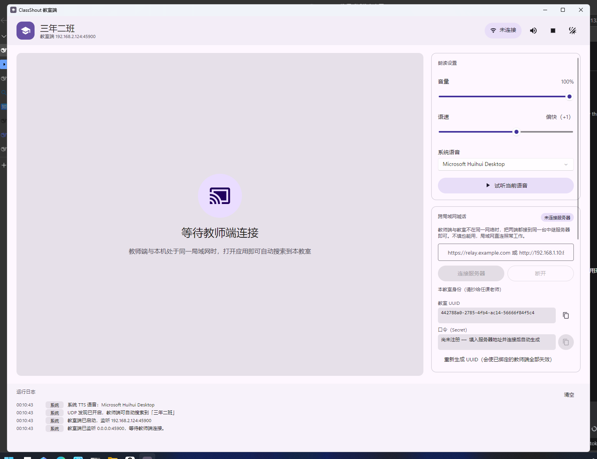
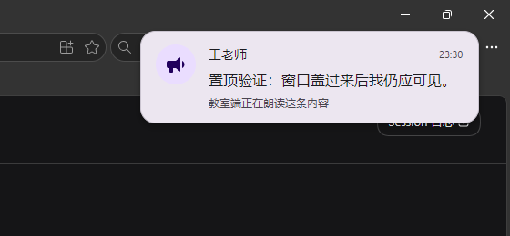
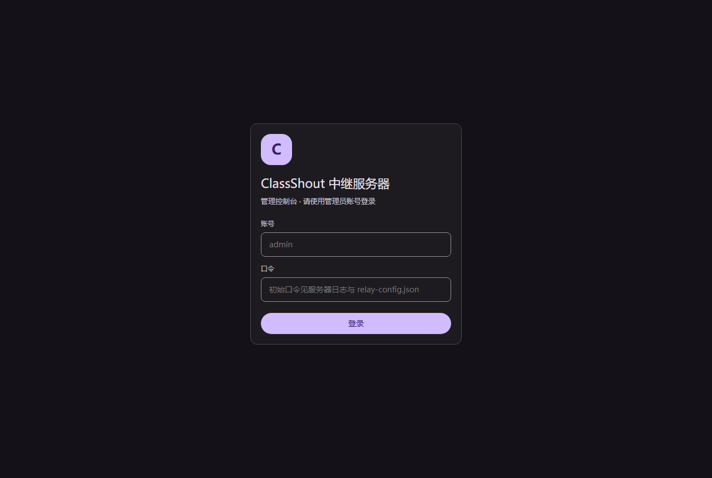
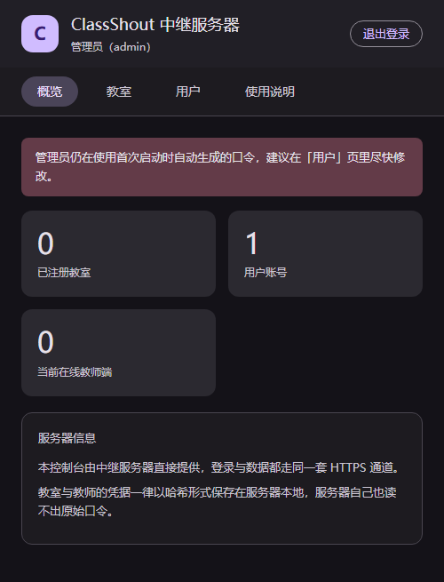
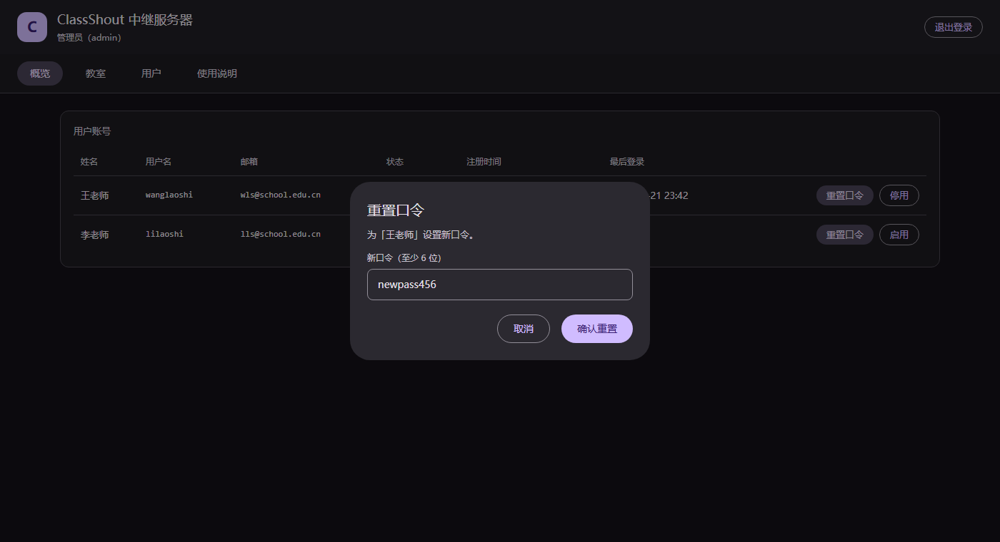
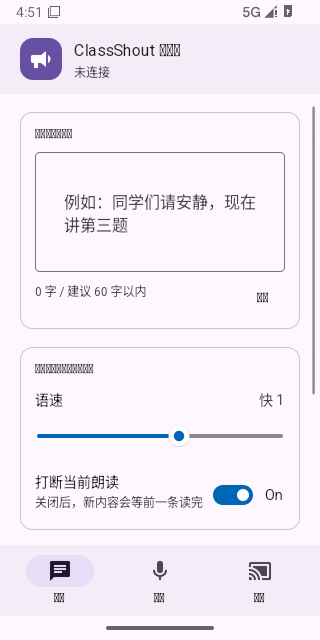
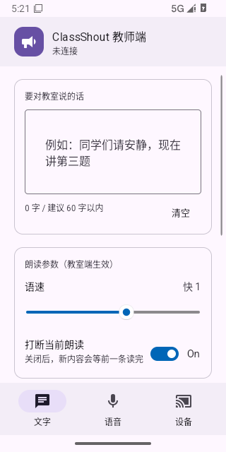
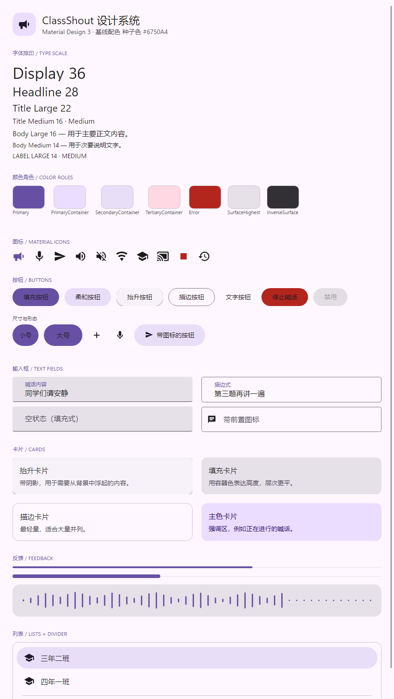
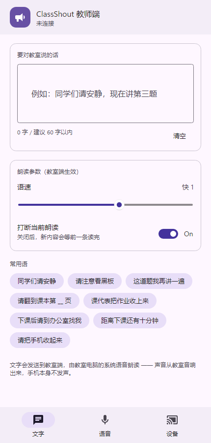
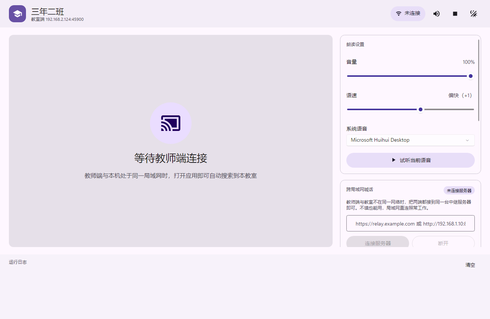

# ClassShout · 课堂喊话

教师用手机向教室电脑喊话：**文字由教室端的系统语音朗读，语音直接从教室音响播放**。
手机本身不发声 —— 声音一定从教室出来，这是「喊话」这个场景的关键。

- 运行时：.NET 10
- 界面框架：Avalonia 11.3.12 + FluentAvaloniaUI 2.5.1
- 视觉语言：Google Material Design 3（自建完整令牌与控件主题）
- 教室端：Windows 桌面应用，TTS 用系统 SAPI（`System.Speech`）
- 教师端：Android 应用（另有桌面头，用于在 PC 上调手机界面）
- 跨网络：可选的中继服务器（自带 WebUI 管理控制台），支持教师与教室不在同一网络

MIT 协议开源。欢迎自建，也欢迎改。详见 [开源协议](#十三开源协议)。

---

## 目录

| | |
|---|---|
| [一、能做什么](#一能做什么) | 功能一览 |
| [二、项目结构](#二项目结构) | 各模块职责与分层原则 |
| [**三、安装与部署**](#三安装与部署) | **从零到能用：打包、部署、首次配置、运维** |
| [四、通信协议](#四通信协议) | TCP 分帧、控制消息、音频格式 |
| [五、跨局域网（中继服务器）](#五跨局域网中继服务器) | 为什么用长轮询、怎么部署、线路一览 |
| [六、账号与安全](#六账号与安全) | 两类账号、口令存储、姓名为何不可冒充 |
| [七、屏幕弹窗](#七屏幕弹窗) | 三档置顶强度与它的边界 |
| [八、WebUI 管理控制台](#八webui-管理控制台) | 服务器自带的管理界面 |
| [九、Material Design 3 设计系统](#九material-design-3-设计系统) | 令牌、控件主题、如何换主题色 |
| [十、验证](#十验证) | 两套自检怎么跑、覆盖了什么 |
| [十一、已知限制](#十一已知限制) | 上线前需要知道的取舍 |
| [十二、开发环境](#十二开发环境) | SDK 与 Android 工具链 |
| [十三、开源协议](#十三开源协议) | MIT |

---

## 一、能做什么

| 能力 | 说明 |
|---|---|
| 文字喊话 | 手机输入 → 教室端用系统 TTS 朗读，可选语速/音量/语音，可打断上一条 |
| 语音喊话 | 手机按住说话 → 教室端实时播放（16 kHz 单声道 PCM，20 毫秒一片，低延迟） |
| 自动发现 | 同一 Wi-Fi 下自动列出所有教室端，无需记 IP；也支持手动填 `IP:端口` |
| **跨局域网** | 两端接到同一台中继服务器即可跨网络喊话，支持多班级并存互不串台 |
| **屏幕弹窗** | 教室端收到喊话时在屏幕边缘弹出提示卡，三档置顶强度可选，且不抢焦点 |
| **账号登录** | 老师用用户名或邮箱注册登录；教室端弹窗显示的是账号里的真实姓名 |
| **管理控制台** | 服务器自带 WebUI：查看教室与用户、重置口令、停用账号 |
| 常用语 | 「同学们请安静」等课堂高频用语一键填入 |
| 教室端控制 | 静音、立即停止、音量、语速、选择系统语音、亮/暗主题 |
| 状态同步 | 教室端的静音与音量实时回传给手机端显示 |
| **后台驻留** | 关闭窗口不退出，教室端缩到通知区域继续接收喊话；退出要经托盘菜单刻意操作 |

---

## 二、项目结构

```
ClassShout/
├─ ClassShout.slnx                     完整解决方案（含 Android）
├─ ClassShout.DesktopOnly.slnf         只含桌面项目，没装 Android SDK 时用这个
├─ docs/开发环境配置.md                 环境与 Android SDK 配置指引
├─ src/
│  ├─ ClassShout.Core/                 协议、网络、音频抽象（纯 .NET，不依赖 Avalonia）
│  │  ├─ Protocol/                     消息模型、JSON 编解码、TCP 分帧
│  │  ├─ Net/                          UDP 发现、教室端服务、教师端客户端
│  │  ├─ Remote/                       跨局域网中继：线路契约、服务器/教师端客户端、账号客户端、本地设置
│  │  └─ Audio/                        音频格式、电平计算、录音/播放/TTS 抽象
│  ├─ ClassShout.RelayServer/          中继服务器（ASP.NET Core）+ WebUI 管理控制台
│  │  ├─ ServerConfig.cs               服务器配置与内置管理员账号（首次启动生成随机口令）
│  │  ├─ UserStore.cs                  用户账号（口令以 PBKDF2 哈希保存）
│  │  ├─ ClassroomStore.cs             教室注册表
│  │  ├─ UserSessions.cs               登录会话令牌
│  │  ├─ RelaySessions.cs              教师端绑定会话
│  │  ├─ MessageHub.cs                 长轮询投递队列
│  │  └─ wwwroot/index.html            管理控制台页面（嵌入资源，无外部依赖）
│  ├─ ClassShout.Design/               Material Design 3 设计系统
│  │  ├─ Md3Theme.axaml                主题入口（应用只需引这一个文件）
│  │  ├─ Md3Typography.cs              平台字重适配（见「踩过的坑」）
│  │  ├─ Themes/Tokens/                颜色/字体/形状/高度/动效/状态层令牌
│  │  ├─ Themes/Controls/              控件主题（Button、TextField、Card、List…）
│  │  ├─ Themes/Md3Styles.axaml        作用于控件实例的全局样式
│  │  └─ Controls/                     自定义控件（Md3Icon、Md3Card、Md3AudioWave）
│  ├─ ClassShout.Teacher/              教师端共享 UI（两个平台头共用）
│  │  └─ Diagnostics/                  字体回退诊断页（真机排查用）
│  ├─ ClassShout.Teacher.Desktop/      教师端桌面头（手机比例窗口，用于调试）
│  ├─ ClassShout.Teacher.Android/      教师端 Android 头（AudioRecord 采集）
│  └─ ClassShout.Classroom/            教室端（Windows，TTS + 音频播放 + 屏幕弹窗）
│     ├─ Services/NotificationPresenter.cs  弹窗生命周期
│     ├─ Services/WindowTopmost.cs      Windows 置顶强度控制
│     └─ Views/NotificationWindow.axaml     弹窗本体
├─ assets/                             应用图标（由 IconGen 生成，勿手工编辑）
├─ scripts/
│  ├─ pack.ps1                        打包脚本：exe + APK，并摆出 dist\release 资产目录
│  ├─ release.ps1                     发布脚本：打包 + 打标签 + 建发行版 + 上传并逐个核对
│  ├─ regress.ps1                     五阶段回归自检（局域网 / 中继 / 托盘 / 单实例 / 前端）
│  └─ smoke-*.ps1、smoke-webui.mjs    单项冒烟测试
└─ tools/
   ├─ ClassShout.DesignPreview/        把界面渲染成 PNG 并做像素级校验
   ├─ ClassShout.EndToEnd/             端到端联调自检（局域网 + 中继两套）
   ├─ ClassShout.IconGen/              程序化生成 Windows .ico 与 Android mipmap
   └─ AndroidSdkBootstrap/             仅用于触发 Android SDK 安装目标
```

### 分层原则

- **Core 不知道 Avalonia 的存在**。协议和网络可以单独测试、单独复用。
- **共享 UI 不知道平台的存在**。教师端的界面代码在 Android 和桌面上完全一样，
  唯一的差异点是启动时注册一个 `IAudioRecorder` 实现。
- **教室端不知道网络细节**。视图模型只管「收到文字就朗读、收到音频就播放」。

数据流：

```
教师端                                    教室端
┌──────────────┐                        ┌──────────────┐
│ MainView     │                        │ MainWindow   │
│  ↓ 命令      │                        │  ↑ 绑定      │
│ ShellViewModel│                       │ ClassroomVM  │
│  ↓           │                        │  ↑ 事件      │
│ ShoutChannel │──TCP 45900──────────→  │ ClassroomServer │
│  ↑           │                        │  ↓           │
│ IAudioRecorder│                       │ TTS / 播放器  │
└──────────────┘                        └──────────────┘
       ↑                                        ↑
       └─────UDP 45901 广播发现（教室端应答）─────┘
```

---

## 三、安装与部署

这一节是给**要把它用起来的人**写的：从零开始，到老师能在手机上喊话为止。
只改代码的人可以直接跳到「九、Material Design 3 设计系统」。

### 3.1 先想清楚要部署哪些组件

| 场景 | 需要部署 | 说明 |
|---|---|---|
| 老师与教室在**同一网络** | 教室端 + 教师端 | 两台设备，不碰服务器，最简单 |
| 老师与教室**不在同一网络** | 再加一台中继服务器 | 例如老师在家、教室在学校 |

两种模式不互斥：**装好服务器后，同网段时仍然自动走局域网直连**，只有直连不可用才会用服务器。
所以「先只装局域网、以后再加服务器」是完全平滑的。

### 3.2 环境要求

| 组件 | 要求 |
|---|---|
| 教室电脑 | Windows 10 / 11 x64。**不需要装 .NET 运行时**（发布的是自包含单文件） |
| 老师手机 | Android 6.0（API 23）及以上 |
| 中继服务器（可选） | 能跑 .NET 10 的 Windows 或 Linux；1 核 1 GB 内存足够。**Linux 已实测**（Ubuntu 24.04，见「十、验证」） |
| 构建机（只需一台） | .NET 10 SDK；要出 APK 还需 Android SDK（见 [`docs/开发环境配置.md`](docs/开发环境配置.md)） |

### 3.3 第一步：在构建机上打包

```powershell
git clone <仓库地址>
cd ClassShout
.\scripts\pack.ps1
```

产物：

```
dist/
├─ windows/
│  ├─ ClassShout.Classroom.exe           教室端（拷到教室电脑）
│  ├─ ClassShout.Teacher.Desktop.exe     教师端桌面头（调试用，可不分发）
│  └─ server/ClassShout.RelayServer.exe  中继服务器（跨局域网部署用，见 3.6）
├─ android/
│  └─ classshout-teacher-<版本>-universal.apk   教师端（发到老师手机）
├─ linux/                                加 -IncludeLinuxServer 时才有
│  ├─ ClassShout.RelayServer             Linux 中继服务器
│  └─ ClassShout.Classroom               Linux 教室端
└─ release/                              **可直接上传的资产目录**
   ├─ ClassShout.Classroom.exe          文件名就是发行版附件名
   ├─ ClassShout.RelayServer-linux-x64
   ├─ classshout-teacher-<版本>-universal.apk
   └─ SHA256SUMS.txt                    校验清单（LF 换行，sha256sum -c 可直接用）
```

`dist\release\` 是发布时唯一需要的东西：`pack.ps1` 已经把每个产物按**最终附件名**摆好，
发布脚本不必再靠记忆去拼"哪个文件叫什么名字"。

三个 exe 都是**自包含单文件**：拷到目标机双击即可，不需要预先安装 .NET 运行时。

> 校验下载完整性（Linux 上直接可用，Windows 上用 `certutil -hashfile <文件> SHA256` 对照）：
>
> ```bash
> sha256sum -c --ignore-missing SHA256SUMS.txt
> ```
>
> `--ignore-missing` 让你只下了其中几个附件时也能校验 —— 没下的条目会被跳过。

> 部署到 **Linux 服务器**时单独发布一次即可：
>
> ```powershell
> dotnet publish src\ClassShout.RelayServer -c Release -r linux-x64 --self-contained true `
>   -p:PublishSingleFile=true -p:IncludeNativeLibrariesForSelfExtract=true `
>   -o dist\server-linux
> ```

打包脚本的其它开关：

| 开关 | 作用 |
|---|---|
| `-FrameworkDependent` | 改为依赖框架发布：教室端 60.9 → 34.0 MB，但目标机必须先装 .NET 10 运行时 |
| `-SplitApk` | 额外为 arm64 / x64 / arm 各出一个 APK（实测 32.6 / 33.3 / 32.0 MB） |
| `-SkipAndroid` | 跳过 Android 打包（本机未配 SDK 时用） |
| `-IncludeLinuxServer` | 额外发布 linux-x64 的中继服务器与教室端，一并摆进 `dist\release` |

#### 发布一个版本（维护者）

```powershell
# 1. 先把 Directory.Build.props 里的 <Version> 改成新版本并提交
# 2. 写一份发行说明（三段：Bug 修复 / 新功能 / 回退，每条形如「说明 · 提交 · 相关提议」）
.\scripts\release.ps1 -Version v1.1.1 -NotesFile notes.md -Proxy http://127.0.0.1:7890
```

`release.ps1` 依次做：校验标签与 `<Version>` 一致 → 校验工作区干净 → 打包 →
打标签并推送 → 建发行版 → 把 `dist\release` 里的附件全部上传 → **逐个核对附件名与大小**。
任何一步对不上就以非零码退出，并回滚刚推上去的标签（要保留请加 `-KeepTag`）。

> 上传在这里不是"发出去就完了"，而是一组必须通过的断言。这个规矩来自一次真实事故：
> v1.1.0 的发行版建好了、说明也写全了，附件却一个都没传上去，过了很久才被发现 ——
> 因为当时没有任何一步去核对"附件到底上去了没有"。

> 替换同名附件后 GitHub 的 CDN 会短暂继续返回旧对象，验证要稍等片刻再做，否则会误判成
> 上传失败或文件损坏。

### 3.4 第二步：部署教室端

1. 把 `ClassShout.Classroom.exe` 拷到教室电脑，放在一个固定目录，例如 `C:\ClassShout\`。

   教室端的配置**不在 exe 旁边**，而是写在当前 Windows 账户的用户目录里：

   ```
   %LOCALAPPDATA%\ClassShout\classroom.json               教室名、UUID、口令、服务器地址
   %LOCALAPPDATA%\ClassShout\classroom-notification.json  弹窗设置
   ```

   这一点是有意为之：程序可能被装在 `Program Files` 这类只读位置，
   而且同一台机器上不同 Windows 账户应当有各自独立的教室身份。
2. 双击运行。首次启动 Windows 可能弹防火墙提示，**要勾选「专用网络」并允许** ——
   局域网模式下教师端需要连进来（TCP 45900）并靠 UDP 45901 被发现。
3. 在界面右侧填写**教室名**（例如「三年二班」），它会显示在教师端和所有弹窗上。

   **要跨局域网的话，服务器地址就在同一列下方的「跨局域网喊话」卡片里**，
   和教室名挨着，不需要改配置文件：

   

   填上服务器地址点「连接服务器」，下方会自动出现本教室的 **UUID** 与 **口令**，
   都能一键复制 —— 把它交给老师，或在管理控制台上直接把班级指派给老师。
4. 调用「朗读设置」里的**试听当前语音**，确认教室里能听到声音。
   听不到的话依次检查：系统音量 → 默认播放设备 → 「系统语音」下拉框选中的语音。

**设为开机自启**（教室电脑通常没人管，重启后要能自己起来）：

```powershell
$exe = "C:\ClassShout\ClassShout.Classroom.exe"
$action  = New-ScheduledTaskAction -Execute $exe
$trigger = New-ScheduledTaskTrigger -AtLogOn
Register-ScheduledTask -TaskName "ClassShout 教室端" -Action $action -Trigger $trigger `
  -RunLevel Highest -Description "课堂喊话教室端"
```

> 用**计划任务**而不是启动文件夹：计划任务可以设「最高权限」并以指定账户运行，
> 也能在无人登录时以服务方式跑（需改 `-AtStartup` 并配置账户密码）。

### 3.5 第三步：部署教师端

**方式 A：adb 安装（手机已开 USB 调试）**

```powershell
adb install -r dist\android\classshout-teacher-<版本>-universal.apk
```

**方式 B：直接发文件**。把 APK 发给老师（微信/网盘），手机上点开安装。
需要老师在系统设置里允许「安装未知来源应用」。

首次启动会申请**麦克风权限**：允许才能用语音喊话；拒绝也不影响文字喊话。

**关于 ABI**：通用包含 arm64 与 x64，约 63 MB，任何手机都能装。
只发真机的话用 `-SplitApk` 出的 `arm64` 包，约 32 MB。

### 3.6 第四步（可选）：部署中继服务器

**把服务器发布产物拷到服务器上**，然后：

```bash
# Linux
chmod +x ClassShout.RelayServer
./ClassShout.RelayServer --urls "http://0.0.0.0:8080"
```

```powershell
# Windows
.\ClassShout.RelayServer.exe --urls "http://0.0.0.0:8080"
```

**首次启动**会在程序目录生成 `relay-config.json`，并把管理员账号与随机口令
**打印到日志**，务必记下来：

> 用 systemd 部署时，这次"首次启动"**必须以服务账号的身份完成**，
> 否则生成的文件归 root 所有，服务账号随后读不到它。
> 具体命令见下面部署步骤的第 3 步。

```
──────────────────────────────────────────────────────────
  已生成管理员账号，请立即记录并妥善保存：
      账号：admin
      口令：LpseCk+kbL5Uy=YR^95v
  该口令同时保存在配置文件：.../relay-config.json
──────────────────────────────────────────────────────────
```

#### 用 systemd 常驻（Linux）

`/etc/systemd/system/classshout.service`：

```ini
[Unit]
Description=ClassShout 中继服务器
After=network.target

[Service]
Type=simple
User=classshout
WorkingDirectory=/opt/classshout
ExecStart=/opt/classshout/ClassShout.RelayServer --urls http://127.0.0.1:8080
Restart=always
RestartSec=5
# 78 是服务器在"状态文件权限不对/内容损坏"时主动返回的退出码。
# 这类问题重启一万次也不会自己好，只会刷爆日志，所以让 systemd 直接放弃。
RestartPreventExitStatus=78

[Install]
WantedBy=multi-user.target
```

部署顺序很重要，**尤其是第 3 步**：

```bash
# 1. 建服务账号和目录
sudo useradd -r -s /usr/sbin/nologin classshout
sudo mkdir -p /opt/classshout
sudo chown classshout:classshout /opt/classshout
sudo chmod 750 /opt/classshout

# 2. 把发布产物拷进去
sudo cp ClassShout.RelayServer /opt/classshout/
sudo chown classshout:classshout /opt/classshout/ClassShout.RelayServer
sudo chmod 755 /opt/classshout/ClassShout.RelayServer

# 3. 让"首次启动"就以服务账号的身份发生，然后按 Ctrl+C 退出
sudo -u classshout /opt/classshout/ClassShout.RelayServer --urls http://127.0.0.1:8080

# 4. 收紧状态文件权限：口令是明文存的，只给宿主自己看
#    （新生成的文件本来就按 600 创建，这一步是给手工放宽过的机器兜底）
sudo chmod 600 /opt/classshout/relay-config.json
sudo chmod 600 /opt/classshout/relay-users.json

# 5. 起服务
sudo systemctl daemon-reload && sudo systemctl enable --now classshout
sudo journalctl -u classshout -f                       # 看日志
```

> **第 3 步为什么不能省**
>
> 如果直接以 root 跑一次来生成配置，`/opt/classshout/relay-config.json` 的宿主就是
> `root`。接着 `chmod 600` 让它变成"只有 root 能读"，而 systemd 是以 `classshout`
> 身份启动的 —— 服务每次启动都会在读取配置时失败。
>
> 症状很好认：`journalctl` 里反复出现
> `UnauthorizedAccessException: Access to the path '/opt/classshout/relay-config.json' is denied`，
> 并且 `restart counter` 一路往上涨。
>
> 已经踩上去了？一条命令修好，`chown` 和 `chmod` 必须一起做：
>
> ```bash
> sudo chown -R classshout:classshout /opt/classshout
> sudo systemctl restart classshout
> ```
>
> `chmod` 只改"谁能读写"，`chown` 才改"算谁的"。只做前者，权限位再漂亮也没用。

服务在监听端口之前会先体检 `relay-state.json`、`relay-users.json`、`relay-config.json`、
`relay-bindings.json` 四个文件，一次性把**全部**问题列出来再退出（而不是每修一处就
要多重启一轮），并给出可以直接照抄的修正命令，例如：

```
fail: ClassShout.RelayServer[0]
      启动中止：状态文件无法使用（共 1 处问题）
      · 服务器配置：文件存在但读不出来
          /opt/classshout/relay-config.json（Permission denied）
      当前进程以账号「classshout」运行。常见原因是：
        · 曾用 sudo 或 root 手工创建过这些文件，使宿主变成了 root；
        · 按安全建议收紧过权限，但只改了 chmod，没有一起改 chown；
        · 或者配置文件里填的路径写错了。
      Linux 上修正（把 classshout 换成服务实际的运行账号）：
          sudo chown -R classshout:classshout /opt/classshout
          sudo chmod 700 /opt/classshout
          sudo chmod 600 /opt/classshout/*.json
```

> **状态文件的权限会被保留**
>
> 四个状态文件都是"先写 `.tmp` 再改名替换"，而替换会让新文件带上进程 umask 的权限。
> 如果不做处理，你把 `relay-config.json` 收紧成 600 之后，只要在 WebUI 里改一次口令，
> 它就会悄悄变回 644 —— 里面是明文口令，却变成同机所有账号都能读。服务器现在会在
> 替换前把原文件的模式位搬到新文件上：**存在就沿用你的设置，全新创建则默认 600**。

#### 用 HTTPS 反向代理（公网部署强烈建议）

服务器本身只监听 HTTP，公网部署请放在反向代理后面。**Caddy 最简单**，证书自动申请续期：

`/etc/caddy/Caddyfile`：

```
relay.example.com {
    reverse_proxy 127.0.0.1:8080
}
```

**Nginx** 版本：

```nginx
server {
    listen 443 ssl http2;
    server_name relay.example.com;

    ssl_certificate     /etc/letsencrypt/live/relay.example.com/fullchain.pem;
    ssl_certificate_key /etc/letsencrypt/live/relay.example.com/privkey.pem;

    client_max_body_size 8m;      # 音频分片不大，但要留够余量

    location / {
        proxy_pass http://127.0.0.1:8080;
        proxy_http_version 1.1;

        # 长轮询会挂住 25 秒，读超时必须比它长
        proxy_read_timeout 120s;
        proxy_buffering off;
    }
}
```

> **`proxy_read_timeout` 一定要放宽**：教室端与教师端靠长轮询接收消息，
> 默认 60 秒在正常情况下够用，但网络抖动时容易被代理提前掐断，
> 表现为"喊话偶尔收不到"。

**防火墙**只需放行 443（或 8080，如果不走反代）：

```bash
sudo ufw allow 443/tcp
```

#### 状态文件与环境变量

| 文件 | 内容 | 备份优先级 |
|---|---|---|
| `relay-config.json` | 管理员账号与口令（**明文**） | 中 |
| `relay-users.json` | 老师账号（口令为哈希） | **高** |
| `relay-state.json` | 教室注册记录与口令哈希 | **高** |
| `relay-bindings.json` | 班级授权 | 中 |

存放目录与监听地址都可以用环境变量或参数指定，方便放进容器：

```bash
export CLASSSHOUT_CONFIG=/data/relay-config.json
export CLASSSHOUT_USER_STATE=/data/relay-users.json
export CLASSSHOUT_RELAY_STATE=/data/relay-state.json
export CLASSSHOUT_BINDING_STATE=/data/relay-bindings.json
./ClassShout.RelayServer --urls http://0.0.0.0:8080
```

### 3.7 第五步：跑通第一个班级

按顺序做完，就有一个能用的班级了。

1. **教室端连服务器**（如果用）：「跨局域网喊话」→ 填服务器地址（例如
   `https://relay.example.com`）→ **连接服务器**。
   首次会在服务器上注册并生成口令，界面上出现 **UUID** 和 **口令**，都能一键复制。

2. **老师注册账号**：教师端「设备」页 → 没有账号？切换到注册 →
   填用户名（3~20 位、字母开头）、邮箱、**姓名**、口令 → 注册并登录。
   这里填的姓名会显示在教室端的弹窗上，**填真名**。

3. **把班级给老师**，两条路选一条：

   | 路径 | 做法 | 适合 |
   |---|---|---|
   | **分配绑定**（推荐） | 管理员打开 `https://relay.example.com` 用 admin 登录 → 「教室」页 → 找到该班级 → **授权给老师** → 选这位老师 | 学校统一管理 |
   | 口令绑定 | 把教室端的 UUID 与口令抄给老师，老师在「跨局域网」里填进去 | 没有控制台、或临时用一下 |

4. **老师绑定**：分配绑定的话，老师在「设备」页的**管理员分配的班级**里点一下即可；
   口令绑定的话点「绑定教室」。绑定成功后顶栏会显示教室名。

5. **验证**：老师发一条文字喊话。教室里应当听到朗读，屏幕边缘弹出提示卡，
   教师端顶栏显示当前链路（同网段是「局域网直连」，跨网络是「公网中继」）。

### 3.8 日常运维

#### 升级

教室端与教师端都是**单文件替换**：关掉旧的、覆盖新文件、重新打开。
配置（教室名、UUID、口令、账号）都存在用户目录里，升级不会丢。

```powershell
# 教室端配置位置（升级前建议备份）
%LOCALAPPDATA%\ClassShout\classroom.json
%LOCALAPPDATA%\ClassShout\classroom-notification.json
```

服务器升级：停服务 → 覆盖程序文件 → **保留四个 `relay-*.json`** → 启服务。
状态文件都在，教室与账号不需要重新注册。

#### 备份

只需备份服务器上的 `relay-users.json`、`relay-state.json`、`relay-bindings.json`
（`relay-config.json` 也备上，它含管理员口令）。三个文件都很小，直接拷走即可。

```bash
tar czf classshout-backup-$(date +%F).tar.gz \
  /opt/classshout/relay-*.json
```

#### 忘记管理员口令

口令就写在服务器的 `relay-config.json` 里，直接查看：

```bash
cat /opt/classshout/relay-config.json
```

如果文件也丢了，删掉它重启即可重新生成 —— 但**普通用户与教室注册不会受影响**，
它们存在另外两个文件里。

#### 忘记教室口令

登录管理控制台 → 「教室」页 → 删除该教室的注册记录。
教室端下次启动时会重新注册并生成新口令（UUID 不变，所以已授权的老师无需重配）。

#### 排错

| 现象 | 检查方向 |
|---|---|
| 教师端搜不到教室端 | 两台设备是否同一网段；教室电脑防火墙是否放行 TCP 45900 / UDP 45901；是否连了不同的 Wi-Fi（有些校园网会隔离客户端） |
| 教室端没声音 | 系统音量与默认播放设备；「系统语音」是否选中了中文语音；是否被静音 |
| 教室端收不到跨网喊话 | 教室端界面是否显示「已连接服务器」；服务器上该教室的「最后在线」是否是刚刚 |
| 老师能连上但一喊话就断 | 反代的 `proxy_read_timeout` 是否够长（见 3.6） |
| WebUI 打不开 | 服务器是否在跑；反代是否配好；端口是否放行 |
| 弹窗被别的窗口盖住 | 把置顶档位调到「UIA 置顶（强制）」；注意它仍盖不住开始菜单、任务管理器这类更高窗口段的系统窗口（原因见「七、屏幕弹窗」） |
| 中文显示成方块（Android） | 已知问题的修复已包含在代码里；若自行改过设计系统，见「踩过的坑：Android 上非 Normal 字重的中文会变方块」 |

还有一条通用手段：教师端「设备」页有**运行日志**，教室端右下角也有，
绝大多数连接问题直接看日志比猜快。

---

---


---

### 教室端也能跑在 Linux 上

教室端有两个产物：`ClassShout.Classroom.exe`（Windows）与 `ClassShout.Classroom`（linux-x64）。
Linux 版的定位是「教室里那台便宜的小主机」——无桌面、开机自启、整天挂着收喊话。

**先装上音频依赖**，否则它装得上、界面也正常，就是不发声：

```bash
sudo apt install alsa-utils        # 提供 aplay（优先用它：直接对 ALSA，不依赖桌面会话）
# 或者
sudo apt install pulseaudio-utils  # 提供 paplay
```

朗读方面，Linux 上没有 Windows SAPI 那样的系统语音，所以**主力引擎是 Edge 在线语音**
（设置里可切）。想要离线保底就再装一个命令行合成：

```bash
sudo apt install speech-dispatcher  # 提供 spd-say
sudo apt install espeak-ng           # 或者 espeak-ng
```

**装完先自检，别等上课才发现**：

```bash
./ClassShout.Classroom --diagnose     # 报告本机各后端可用情况
./ClassShout.Classroom --audio-test   # 真的走一遍播放链路（放 200 毫秒静音）
```

`--diagnose` 的输出形如：

```
平台：Linux
音频播放：不可用 —— 找不到 aplay 或 paplay。
           安装：apt install alsa-utils（或 pulseaudio-utils）
系统朗读：不可用 —— 找不到 spd-say、espeak-ng 或 espeak。
在线朗读：Edge 在线语音（需要能访问 speech.platform.bing.com）
托盘图标：由 Avalonia 提供；Linux 上需要桌面环境的通知区域支持。
```

**开机自启（systemd）**。注意教室端要访问音频设备，别用 `nologin` 的服务账号：

```ini
[Unit]
Description=ClassShout 教室端
After=network.target sound.target

[Service]
Type=simple
User=classroom
Environment=XDG_RUNTIME_DIR=/run/user/%U
ExecStart=/opt/classshout/ClassShout.Classroom
Restart=always
RestartSec=5

[Install]
WantedBy=graphical.target
```

> `WantedBy=graphical.target` 而不是 `multi-user.target`：Avalonia 需要一个显示后端。
> 如果是完全无桌面的机器，得配一个 X 虚拟显示（Xvfb）或者用 `weston --backend=headless`。
> 教室里有屏幕的场景直接用图形目标即可。

**Linux 上托盘图标依赖桌面环境的通知区域**。没有通知区域时程序会退回「关闭即退出」
（不会留下一个关不掉的窗口），但那样也就失去了「关闭窗口仍继续收喊话」的能力 ——
所以要么装一个带通知区域的桌面，要么别关那个窗口。

---
### 关闭窗口 = 缩到托盘，不是退出

教室端**点关闭按钮不会退出**，而是缩到通知区域继续接收喊话；双击托盘图标恢复窗口，
要完全退出请右键托盘图标 →「退出」。

这是刻意的。"关闭窗口"离"最小化"只有一个像素，而教室里的人顺手点一下 ×，
整个班就此失联，并且不会有任何人发现 —— 直到下一位老师喊话没人应。

退出因此变成一个需要刻意完成的动作（右键 → 退出），而不是一个误触就能达成的事故。

电脑关机、注销、重启时**正常退出**，不会被窗口拦住：只有"用户点了 ×"这一种
关闭原因会被拦下，操作系统发起的关闭一律放行（`WindowCloseReason.OSShutdown`）。
不然夜里定时关机的教室电脑会弹"此应用正在阻止关机"。

> 实现见 `src/ClassShout.Classroom/Services/TrayPresence.cs`。它自己订阅窗口的
> `Closing`，所以 `MainWindow` 没有为托盘改一行代码。
> 万一通知区域图标创建失败（极端情况下的 shell 异常），程序会退回"关闭即退出"
> 并在日志里说明，而不是留下一个关不掉的窗口。

---

## 四、通信协议

教师端与教室端在同一局域网内直连，无需服务器。

### 端口

| 端口 | 协议 | 用途 |
|---|---|---|
| 45900 | TCP | 控制消息 + 音频流（同一条连接，靠帧类型区分） |
| 45901 | UDP | 教室发现（教师端广播探测，教室端单播应答） |

### TCP 分帧

```
┌──────────────┬──────────┬─────────────────────┐
│ 4 字节长度    │ 1 字节类型 │ 负载                 │
│ （大端，含类型）│ 1=控制    │ JSON 或 PCM          │
│              │ 2=音频    │                     │
└──────────────┴──────────┴─────────────────────┘
```

音频与控制共用一条连接：避免额外端口，也天然保证「先收到 audioStart 再收到音频数据」的顺序。

### 控制消息

JSON 编码，以 `type` 字段区分：

| type | 方向 | 说明 |
|---|---|---|
| `hello` | 教师 → 教室 | 握手，带协议版本与教师端名称 |
| `status` | 教室 → 教师 | 握手后自动回发，带教室名、静音、音量 |
| `textShout` | 教师 → 教室 | 文字喊话，带语速/音量/语音/是否打断 |
| `audioStart` | 教师 → 教室 | 语音开始，带采样率/声道/位深 |
| `audioEnd` | 教师 → 教室 | 语音结束 |
| `stop` | 教师 → 教室 | 立即停止朗读与播放 |
| `ack` / `error` | 双向 | 回执与错误 |
| `bye` | 教师 → 教室 | 主动断开 |

### 音频格式

16 kHz / 单声道 / 16 位 PCM，每片 20 毫秒（640 字节），约 32 KB/s。

没有引入 Opus 之类的编解码器：局域网上这个码率几乎不占带宽，而零依赖意味着
更低的延迟和更少的故障点。格式写在 `audioStart` 里，两端不强耦合 ——
Android 头若换用别的采样率，教室端会自动按收到的参数播放。

---

## 五、跨局域网（中继服务器）

老师和教室不在同一个网络时（老师在家、教室在学校），直连不可能建立。
这时让两端都去连一台双方都能访问到的服务器，由它转发。

### 为什么不是「真正的 Webhook」

Webhook 的标准含义是"服务器主动 POST 到你注册的 URL"。但教室端在 NAT 之后，
公网服务器**连不进去**，这个方向根本走不通。

所以投递改用 **HTTP 长轮询**：教室端发一个 GET 并保持住，服务器有喊话时才响应。
在教室端看来与收到 webhook 回调没有区别，而在任何网络环境下都能工作，
断线重连的语义也天然幂等（带上 `since` 游标即可续上，不需要自己实现心跳与重连状态机）。

### 部署服务器

```powershell
dotnet run --project src\ClassShout.RelayServer -- --urls "http://0.0.0.0:8080"
```

首次启动会在程序目录生成 `relay-config.json`，并往日志里打印管理员账号与随机口令：

```
──────────────────────────────────────────────────────────
  已生成管理员账号，请立即记录并妥善保存：
      账号：admin
      口令：LpseCk+kbL5Uy=YR^95v
  该口令同时保存在配置文件：.../relay-config.json
  登录后可在此修改口令，修改后配置里的值会同步更新。
──────────────────────────────────────────────────────────
```

控制台地址就是服务器地址本身：`http://<服务器>:8080/`。

生产部署建议放在 HTTPS 反向代理（Nginx / Caddy）之后，并把
`relay-config.json`、`relay-users.json`、`relay-state.json` 三个文件的权限收紧。

### 接入流程

**教室端**：右侧「跨局域网喊话」→ 填服务器地址 → 点「连接服务器」。
首次连接会向服务器上报本教室的**名字与 UUID** 并完成注册，界面上会显示
**UUID** 与 **口令**，两者都可一键复制。之后若在教室里改了名字，会自动同步到服务器。

**教师端**有两条绑定路径，任选其一：

| 路径 | 适合 | 做法 |
|---|---|---|
| 口令绑定 | 没有控制台、或临时用一下 | 「设备」页填服务器地址、教室 UUID、口令 → 「绑定教室」 |
| **分配绑定** | 学校统一管理 | 管理员在控制台上把班级指派给老师，老师在「管理员分配的班级」里**点一下即绑定** |

分配绑定的价值在于：口令一旦转发给老师就会扩散，而授权始终收在服务器上，
收回权限也只需要在控制台点一下「取消授权」——取消后已建立的连接会立即断开。

### 链路优先级：局域网 > 服务器

两条链路可以同时存在，优先级是**硬性**的：

```
局域网直连可用  →  一律走直连（延迟最低、不占公网带宽、不经过任何中间服务器）
直连不可用      →  自动回落到公网中继
两者都不可用    →  停止发送
```

直连断开时会自动检查中继是否还绑着，绑着就切过去；重新回到同网段后又自动切回直连。
教师端顶栏有一个常驻标签显示**当前实际在用的链路**，不必猜。

### 多班级

服务器以 UUID 区分教室，各教室的消息队列彼此独立 ——
一台服务器可以同时服务整个学校的班级，教师端绑到哪个教室就只收哪个教室的状态。

### 线路一览

| 方法 | 路径 | 用途 |
|---|---|---|
| `GET` | `/` | 管理控制台页面 |
| `POST` | `/api/auth/register` | 注册（用户名与邮箱至少一个） |
| `POST` | `/api/auth/login` | 登录（用户名或邮箱均可） |
| `GET` | `/api/auth/me` | 查询当前登录身份 |
| `POST` | `/api/classrooms/register` | 教室注册 / 带口令重连 |
| `GET` | `/api/classrooms/{uuid}` | 查询教室是否已注册 |
| `POST` | `/api/teachers/bind` | 教师绑定教室（UUID + 口令） |
| `POST` | `/api/teachers/{token}/text` | 发文字喊话 |
| `POST` | `/api/teachers/{token}/audio` | 发音频分片（裸二进制） |
| `GET` | `/api/teachers/{token}/events` | 教师端长轮询收教室状态 |
| `GET` | `/api/classrooms/{uuid}/events` | **教室端长轮询收喊话** |
| `POST` | `/api/classrooms/{uuid}/status` | 教室上报静音与音量 |
| `GET/DELETE/POST` | `/api/console/...` | 控制台接口（仅管理员） |

会话令牌走请求头（`X-Relay-Token` / `X-Auth-Token`）而不是查询串 ——
查询串会进访问日志，口令不该留在日志里。

---

## 六、账号与安全

### 两类账号，两套存储

| | 内置管理员 | 普通用户（老师） |
|---|---|---|
| 账号 | 固定 `admin` | 用户名和/或邮箱 |
| 口令存储 | **明文存在 `relay-config.json`** | PBKDF2-SHA256 + 随机盐，存在 `relay-users.json` |
| 为什么 | 运维必须能查出来，否则忘了就只能删文件重启重新生成 | 终端用户口令，服务器自己也不该读得出来 |
| 管理能力 | 进管理控制台、重置他人口令、停用账号 | 无 |
| 班级权限 | **默认对所有班级可用**，无需授权 | 由管理员在「班级授权」页逐条指派 |

内置管理员的口令放在服务器本地的配置文件里，靠文件权限保护 ——
这是自建服务器运维账号在这个规模下的合理取舍，但它确实是一份明文凭据，
**不要把这台服务器的磁盘快照或配置文件外发**。

### 管理员的班级权限是隐式的

内置管理员默认就能绑定任意班级、也不需要口令，控制台的「班级授权」页里**不会**
为它生成记录。这是刻意的：如果改成"启动时把每个班级都授权给管理员"，那么每注册
一间新教室都得回头补一条，是个永远追不上的循环。

代价是这条权限在授权列表里看不见，所以「用户」页把管理员列在第一行并标出
「内置管理员」，「班级授权」页也写明它不在此列。

管理员也是唯一能在「用户」页里改自己口令的账号 —— 它的重置口令按钮可用，
但没有「停用」按钮：停用它等于把自己锁在控制台外面。

### 老师姓名不可冒充

教师端绑定教室时会把登录令牌一起带上，服务器**以账号里的姓名为准**，
忽略客户端传过来的字符串。这样教室端弹窗上显示的"哪位老师"才是可信的。

这条有测试覆盖：端到端用例故意在 `bind` 时传一个假名字，断言教室端收到的仍是注册姓名。

### 口令重置

管理员在控制台「用户」页点「重置口令」即可。重置后：

- 该账号的旧口令立即失效；
- 该账号**已签发的登录令牌同时作废**，需要重新登录 ——
  否则"改密码"就挡不住已经登录的会话。

---

## 七、屏幕弹窗

教室端收到喊话时，在屏幕边缘弹出一张小卡片，显示老师姓名、时间与喊话内容。

两个刻意的设计：

- **不抢焦点**（`ShowActivated=False` + `WS_EX_NOACTIVATE`）：老师正在投屏或操作时，
  提示不该把当前窗口顶下去；
- **不进 Alt+Tab**（`WS_EX_TOOLWINDOW`）：它是通知，不是一个应用窗口。

### 三档置顶强度

| 档位 | 行为 |
|---|---|
| 不置顶 | 普通窗口。别的窗口被激活后会被盖住 |
| 普通置顶 | 设置系统置顶。若别的程序也抢置顶，可能被压下去 |
| UIA 置顶（强制） | 在系统置顶之上周期性重申（每秒一次），能抢过多数置顶窗口 |

下图是实测：把教室端窗口移到弹窗所在位置，弹窗仍稳定压在最上层。



**关于"UIA 置顶"这个说法的边界**：Windows 存在"窗口段"机制，普通置顶窗口盖不住
更高窗口段的东西（开始菜单、任务管理器、通知中心等）。要盖住它们必须持有
**UIAccess 令牌**，而 Windows 要求 UIAccess 程序**必须数字签名且安装在安全目录**
（如 `Program Files`），否则清单里的 `uiAccess="true"` 会让程序直接无法启动。

因此未签名的便携版本做不到真正的 UIA 置顶，当前实现的是"周期性重申置顶"这一档。
如果后续要对 exe 签名并安装到安全目录，在 `app.manifest` 里加上
`<requestedExecutionLevel level="asInvoker" uiAccess="true"/>` 即可获得完整能力。

---

## 八、WebUI 管理控制台

服务器自己提供管理界面，登录与数据都走同一套通道 —— 不需要额外部署前端。

```
http://<服务器地址>:8080/
```

用内置管理员账号登录后有四页：

| 页面 | 内容 |
|---|---|
| 概览 | 已注册教室数、用户数、当前在线教师端数；初始口令未改时给出提醒 |
| 教室 | 教室名、UUID、在线教师数、注册与最后在线时间；可删除注册记录 |
| 用户 | 姓名、用户名、邮箱、状态、注册与最后登录时间；可重置口令、停用/启用 |
| **班级授权** | 已授权的「老师 ↔ 班级」配对；可取消授权（取消后连接立即断开） |
| 使用说明 | 教室端与教师端该怎么接进来的分步说明 |

「教室」页每一行都有 **授权给老师** 按钮，选中一位老师即可完成指派 ——
这就是老师端「管理员分配的班级」列表的数据来源。

几个实现上的选择：

- **页面作为嵌入资源编译进程序集**，不走 `wwwroot` 静态文件中间件。
  这样换工作目录、单文件发布都不会出现"页面 404"。
- **完全不引外部 CDN**。服务器可能部署在没有外网的内网里，
  页面一旦依赖外部资源就会整个白屏。所有 CSS 与 JS 都内联，配色直接用 MD3 令牌。
- **停止账号后立刻撤销其所有登录令牌**，否则已登录的客户端还能继续用。
  重置口令同理。







---

### 在控制台上直接管账号与喊话

控制台不只是看数据的地方，日常几件事都能在这里做完：

| 做什么 | 在哪 |
|---|---|
| **手动加一个老师账号** | 「用户」页 → 添加账号 |
| **开学时一次录一批老师** | 「用户」页 → 批量导入 CSV |
| **临时对某个班喊一句话** | 「教室」页 → 该班级那一行的「喊话」 |

**批量导入的 CSV 格式**：每行 `用户名,邮箱,姓名,口令`，用户名与邮箱至少填一个
（另一个留空即可）。**可以直接从 Excel 里复制粘贴** —— 带表头、带空行、带引号都会自动处理，
`#` 开头的行视为注释。

> 逐行独立处理：某一行不合格只跳过那一行，**不整批失败**。
> 一次导入几十条时，"第 7 行邮箱格式不对"远比"整批失败"有用 ——
> 失败行会带着行号留在对话框里，改完可以接着再导一次。

**「喊话」**走的是和教师端完全相同的那条转发通路（同一个广播通道、同一个信封格式），
只是来源显示为 `admin（控制台）`，教室端弹窗上能看出这句话是谁说的。

登录失败时如果账号不存在，会弹一个明确的提示：老师账号要在教师端 APP 上自己注册，
管理员账号则由服务器首次启动时生成 —— 而不是让人对着"账号或口令不正确"发呆。

> 服务端**刻意不区分**"账号不存在"与"口令错误"（那样可以被用来枚举账号）。
> 提示里的下一步建议是控制台这一侧对那句合并提示给出的，服务端并没有变成账号探测器。

---
## 九、Material Design 3 设计系统

### 应用接入方式

```xml
<Application.Styles>
  <fa:FluentAvaloniaTheme PreferSystemTheme="False" />
  <StyleInclude Source="avares://ClassShout.Design/Md3Theme.axaml" />
</Application.Styles>
```

顺序不能颠倒：Md3 主题在后才能覆盖 Fluent 的默认控件样式。
Fluent 底座负责 Md3 没有重做的控件（下拉框、滚动条、弹窗等），
这样不会出现「没被覆盖的控件长得格格不入」。

### 覆盖了哪些内容

- **颜色**：完整 MD3 色角色（48 项），亮/暗双主题，含 Surface 容器五级层次与 Fixed 色
- **字体**：15 种标准样式（Display/Headline/Title/Body/Label），以 `Classes="headlineSmall"` 使用
- **形状**：7 级圆角标度
- **高度**：5 级阴影
- **动效**：12 档时长 + 4 种缓动
- **状态层**：8% 悬停 / 10% 按下 / 38% 禁用内容 / 12% 禁用容器
- **控件**：Button（5 种变体 × 3 种尺寸）、TextBox（填充式/描边式，含浮动标签）、
  Card（4 种变体）、ListBoxItem、ProgressBar、Md3Icon、Md3AudioWave

另把 Avalonia 的 `SystemAccentColor` 对齐到 MD3 主色，因此滑块、开关、下拉框、
滚动条这些没有重做模板的控件也会呈现 MD3 配色，而不是系统默认的蓝色。

### 换主题色

不需要改设计系统。在应用的 `Application.Resources` 里用同名 key 覆盖即可：

```xml
<Application.Resources>
  <ResourceDictionary>
    <ResourceDictionary.ThemeDictionaries>
      <ResourceDictionary x:Key="Light">
        <SolidColorBrush x:Key="Md3.Primary" Color="#00696D" />
        <SolidColorBrush x:Key="Md3.OnPrimary" Color="#FFFFFF" />
        <SolidColorBrush x:Key="Md3.PrimaryContainer" Color="#6FF6FC" />
        <SolidColorBrush x:Key="Md3.OnPrimaryContainer" Color="#002021" />
      </ResourceDictionary>
      <ResourceDictionary x:Key="Dark"> <!-- 同理给一套暗色值 --> </ResourceDictionary>
    </ResourceDictionary.ThemeDictionaries>
  </ResourceDictionary>
</Application.Resources>
```

应用层资源查找优先级更高，会自动生效。完整色角色清单见
`src/ClassShout.Design/Themes/Tokens/Color.axaml`。

### 应用图标

图标不是外挂素材，而是由 `tools\ClassShout.IconGen` 用代码生成的：

```powershell
dotnet run --project tools\ClassShout.IconGen -- .
```

- 图形取自 Material.Icons 的路径数据，配色取自 MD3 基线色板，与界面同一套设计语言
- 教师端：喇叭图形 + 主色 `#6750A4`；教室端：学校图形 + 次级色 `#625B71`（便于任务栏区分）
- 一次产出 Windows 的 `.ico`（16/24/32/48/64/128/256 七个尺寸）
  与 Android 的 mipmap（5 档密度 × 普通/圆形两种形状）
- 每个尺寸都独立渲染而非缩放，小尺寸下笔画不会糊

改配色或换图形只需改 `Program.cs` 里的两个常量，重新生成即可保持全部尺寸一致。
### 踩过的坑：Android 上非 Normal 字重的中文会变方块

**现象**：教师端在 Android 真机上，部分中文显示成方块（tofu），而同一行里的
拉丁字母正常、其他中文也正常。

**定位过程**：在 Android 16 / x86_64 模拟器上做对照实验 ——
5 种字体链 × 4 档字重排成矩阵渲染，结论非常干净：

- **字体族完全无关**：不指定字体族、只写 `Noto Sans CJK SC`、只写 `sans-serif`、
  只写 `Roboto`，表现一模一样；
- **字重是决定因素**：`Normal` 下中文全部正常，`Medium` / `SemiBold` / `Bold`
  下中文全部变方块，而拉丁字母始终正常；
- 模拟器上系统只有 `NotoSansCJK-Regular.ttc` —— **只有 Regular 一档**。

所以根因是：Android 上 Avalonia 的逐字字形回退只覆盖 `Normal` 字重，
非 Normal 时解析到的字体没有中文字形，回退又不生效。换字体族解决不了。

修复前后（Android 16 模拟器实拍）：

| 修复前 | 修复后 |
|---|---|
|  |  |

**修复**：把 MD3 的强调字重做成资源 `Md3.Weight.Emphasis`，
Android 头在创建视图前把它覆盖为 `Normal`（见 `Md3Typography.ApplyPlatformDefaults`）。
Windows 保持 `Medium`，MD3 的层次感不受影响。

**顺带修掉的两个问题**：

1. `Md3.FontFamily` 原本挂在 `Style Selector="Window"` 上 ——
   而 Android 上根本没有 `Window`（用的是 `ISingleViewApplicationLifetime`），
   字体链在 Android 上从未生效过。改为 `TopLevel`（`Window` 与 Android 宿主视图的共同基类）。
2. 曾尝试用 `{OnPlatform Default=Medium, Android=Normal}` 做平台条件，
   但平台条件语法写在 `Setter` 的 `Value` 里只会得到一个字符串，
   不会转换成 `FontWeight`，运行时直接抛 `InvalidCastException` 把应用搞崩。
   资源 + 运行时覆盖才是可行路径。

排查工具保留在 `src/ClassShout.Teacher/Diagnostics/FontDiagnostics.axaml`：
把 `App.ShowFontDiagnostics` 改成 `true` 重新打包，应用启动后会直接进入字重矩阵页 ——
真机上一眼就能看出哪些组合可用，不必靠"改代码、打包、安装、截图"反复试。

---

## 十、验证

这个项目自带两套自检，改动后可以直接跑一遍确认没坏。

一路跑完最省事：

```powershell
pwsh -File scripts/regress.ps1        # 先构建，再跑局域网 + 中继两个链路
```

脚本会自己起一台临时中继服务器（全新状态目录 + `CLASSSHOUT_*` 环境变量），
测完自动清理，不会碰到你部署中的实例。

### 端到端联调

```powershell
# 局域网直连链路（18 项）
dotnet run --project tools\ClassShout.EndToEnd
dotnet run --project tools\ClassShout.EndToEnd -- --tts        # 真的用喇叭读一句中文

# 中继链路（34 项）—— 需要先自行启动中继服务器
dotnet run --project src\ClassShout.RelayServer -- --urls "http://127.0.0.1:8090"
dotnet run --project tools\ClassShout.EndToEnd -- --relay http://127.0.0.1:8090
```

跑的都是真实实现（不是 mock）。

**局域网链路（18 项）**：UDP 发现 → TCP 握手与状态回传 → 文字喊话 →
语音流逐字节校验（25600 字节逐片比对，确认无错位乱序）→ 停止指令 →
音频播放链路 → 系统 TTS → 断开清理。

**中继链路（34 项）**：教室注册（含新记录标记）→ 账号注册/登录/登出 →
错口令与不存在账号同样被拒 → 口令错误的绑定被拒 → UUID 不存在的绑定被拒 →
正确凭据绑定 → 文字喊话 → **喊话来源是账号里注册的姓名而非客户端自填** →
语音流逐字节校验 → 停止指令 → 反向状态通道 → 班级授权（授权前被拒 /
授权后免口令绑定 / 取消后再次被拒）→ 内置管理员（出现在用户列表、
不能被停用、无需授权即可看到所有班级、可空口令绑定任意班级）→ 多班级隔离。

全部通过返回 0，可直接接进 CI。

> 用 `dotnet run` 传管理员口令时注意参数转义会弄坏含 `%`、`#` 的值，
> 改用环境变量 `CLASSSHOUT_ADMIN_PASSWORD` 或直接调用编译好的 exe。

### 教室端托盘驻留的运行时验证

关闭窗口缩到托盘这种事，改坏了不会有任何报错 —— 程序照样编译通过、照样启动、
点关闭也确实关掉了，只是"关掉了"和"藏起来了"从代码上看不出区别。
所以它有一条专门的冒烟测试：

```powershell
pwsh -File scripts\smoke-tray.ps1
pwsh -File scripts\smoke-tray.ps1 -Exe dist\windows\ClassShout.Classroom.exe   # 直接测打包产物
```

做法是给主窗口发 `WM_CLOSE`（等价于用户点右上角的 ×），然后断言**进程仍存活
且主窗口句柄消失**。这一条顺带覆盖了托盘图标资源路径 —— 图标是作为 Avalonia
资源嵌入的，路径写错会让 `TryInstall` 返回 null、程序退回"关闭即退出"，
于是进程就没了，断言随之失败。

`scripts/regress.ps1` 已经把它作为第三段接了进去。

### 跨平台验证：Windows 客户端 ↔ Linux 服务器

中继服务器不只"能编译到 Linux"，而是真的跑过一遍：

```bash
# 在 WSL / Linux 主机上
dotnet publish src/ClassShout.RelayServer -c Release -r linux-x64 --self-contained true \
  -p:PublishSingleFile=true -p:IncludeNativeLibrariesForSelfExtract=true -o dist/server-linux
./dist/server-linux/ClassShout.RelayServer --urls http://0.0.0.0:8080
```

```powershell
# 在 Windows 上，用客户端去打这台 Linux 服务器
$env:CLASSSHOUT_ADMIN_PASSWORD = "<从服务器 relay-config.json 里读到的口令>"
dotnet run --project tools\ClassShout.EndToEnd -- --relay http://<linux-host>:8080
```

实测结果（Ubuntu 24.04 / x86_64 上的自包含单文件）：**29/29 通过** ——
包含账号鉴权、班级授权、音频逐字节一致性、多班级隔离，与 Windows 服务器上的结果一致。
日志里的中文也正常输出。

> **用 `dotnet run` 传管理员口令时注意**：`dotnet run` 转发参数会弄坏含 `%`、`#` 的值，
> 导致明明口令正确却登录失败。用环境变量 `CLASSSHOUT_ADMIN_PASSWORD` 传，
> 或直接调用编译好的 exe 即可绕开。这是 `dotnet run` 的行为，不是应用的问题。

### 界面渲染校验

```powershell
dotnet run --project tools\ClassShout.DesignPreview -- artifacts
```

把设计系统画廊和两个应用的真实界面渲染成 PNG，并做像素级自检：

- **内容判据**：不同颜色数 > 200（空白页只有一两种颜色）
- **布局判据**：占比最高的单色 < 85%（整片同一色说明内容没布局出来）
- **令牌判据**：各画面应当出现的 MD3 颜色确实出现在渲染结果中

这能自动发现「样式没加载」「令牌没解析」两类最常见故障，不需要人逐张看图。
产物在 `artifacts/`（生成物，不进版本控制）；下面这些是挑出来随文档走的：







| 文件 | 内容 |
|---|---|
| `design-system-light.png` / `-dark.png` | MD3 组件画廊 |
| `teacher-light.png` / `-dark.png` | 教师端文字喊话页（手机比例） |
| `classroom-light.png` / `-dark.png` | 教室端待机界面 |

---

## 十一、已知限制

1. **SkiaSharp 16 KB 页对齐告警**
   构建 Android 时会看到 `warning XA0141`：Avalonia 11.3.12 锁定的 SkiaSharp 2.88.9
   原生库未按 Android 16 要求的 16 KB 页对齐。
   本地开发和 4 KB 页设备（绝大多数手机）不受影响；
   若要上架 Google Play（2025 年 11 月起对 targetSdk 35+ 强制要求），
   需整体升级到 Avalonia 12.1.x + FluentAvalonia 3.1.0，那套用 SkiaSharp 3.119.x。

2. **APK 体积约 63 MB**（arm64 + x64 两个 ABI）
   体积大头是 `libassembly-store.so`（约 29 MB），即托管程序集被打包成原生库 —— 根源是
   关闭了裁剪以保证 Avalonia 的 XAML 反射解析不出问题。
   几个可选方向：
   - 只保留 `android-arm64`：约 32 MB（改 `RuntimeIdentifiers` 即可）
   - 改用 `AndroidLinkMode=SdkOnly`：只裁剪 BCL，保留 Avalonia 与业务程序集，
     风险可控，但**必须在真机上实测**后再上线
   - 发布到 Google Play 时用 AAB 格式，商店会按设备 ABI 自动拆分

3. **局域网链路的音频未加密**
   同网段直连是"有连接即接受"，没有配对码。校园内网可以接受，
   但如果教室端暴露在不可信网络里，应当改用中继链路（走 HTTPS）而不是开直连。

4. **中继链路本身不做端到端加密**
   服务器能看到文字内容与音频字节。它只做转发，不存储喊话内容，
   但"服务器可信"是这套设计的前提。要防止这一点需要端到端加密，当前没有实现。

5. **管理员口令以明文存在服务器配置文件里**
   这是为了让运维随时查得到（见「账号与安全」）。请收紧该文件权限，
   不要把服务器磁盘快照或配置文件外发。

6. **一对一喊话**
   教室端可同时接受多个教师端连接，但同一时刻只播放其中一路；
   没有实现多教师端的排队或抢麦机制。

7. **语音喊话上限 5 分钟**
   防止忘记松手一直录下去，到时会自动结束并发送。

8. **中继投递延迟约 100 毫秒起**
   教师端的音频在本地累积到 100 毫秒才发一趟 HTTP（每秒 50 个请求不可接受）。
   加上长轮询与网络往返，跨局域网语音的端到端延迟比局域网直连明显更高。
   这是"跨公网可用"换来的代价，同网段时走直连没有这个问题。

---

## 十二、开发环境

见 [`docs/开发环境配置.md`](docs/开发环境配置.md)，其中包含实测过的
Android SDK 组件版本（`android-36` + `build-tools 36.0.0` + JDK 17）
与常见报错处理。

---

## 十三、开源协议

[MIT](LICENSE) © 2026 WRD1145

简单的说：随便用，商用也行，改完也不用开源；只要保留版权声明，并且别找我索赔。
自建一台给学校用、或者改成自己学校的样子，都在许可范围内。

第三方组件的许可随各自的 NuGet 包发布，主要几个都是宽松协议：

| 组件 | 协议 | 用途 |
|---|---|---|
| Avalonia | MIT | 界面框架 |
| FluentAvaloniaUI | MIT | Fluent 主题基础 |
| NAudio | MIT | 音频采集与播放 |
| Material.Icons | MIT | 图标字形 |
| System.Speech | MIT | 教室端的系统 TTS |
